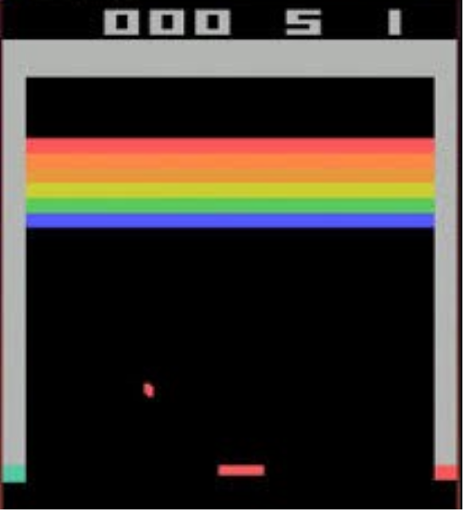

# DQN_atari-Breakout
The goal of this project is to implement a DQN agent playing atari breakout game on Openai Gym environment. Breakout is a classic arcade game where a player moves a paddle to bounce a ball and break bricks. The DQN algorithm, a combination of Q-learning (a model-free reinforcement learning algorithm) and deep neural networks, aims to teach a computer agent to play Breakout not by following pre-defined rules, but by learning from its own actions and their consequences.

## 1. Deep Q-Network (DQN):

  * DQN integrates Q-learning with deep neural networks. Q-learning aims to learn the value (Q-value) of taking a particular action in a given state, guiding the agent to high-reward actions. The deep neural network approximates these Q-values for all possible actions in a state.

## 2. The Atari Breakout Game Environment:

  * The environment for the DQN is the Atari Breakout game, typically provided by environments like OpenAI Gym. In this game, the agent controls the paddle with the objective to break as many bricks as possible without letting the ball pass through.

## 3. Preprocessing and Network Architecture:

  * Preprocessing involves transforming the game frames into a suitable format for the neural network, like resizing, grayscale conversion, and frame stacking for temporal context.
  * The network architecture generally includes convolutional layers (to process visual input) and fully connected layers (to estimate Q-values).

## 4. Training the Agent:

  * The agent is trained iteratively. At each step, it selects an action based on the current policy (derived from the Q-values), observes the reward and the next state, and stores this experience in a replay buffer.
  * The replay buffer randomly samples experiences to break correlation between consecutive learning steps, improving stability.
  * The network is updated by minimizing the difference between predicted Q-values and the target Q-values (calculated using the reward received and the maximum Q-value for the next state).

## 5. Exploration vs. Exploitation:

  * A key challenge is balancing exploration (trying new actions) and exploitation (using known information). This is often managed using an ε-greedy strategy, where the agent randomly explores with probability ε and exploits its current knowledge otherwise.

## 6. Reward Strategy:

  * The reward strategy is crucial in reinforcement learning. For Breakout, the agent is rewarded for every brick broken or penalized for losing the ball.

for further details and results see the [Report](https://github.com/thabsheerjm/DQN_atari-Breakout/blob/main/dep/Report.pdf)

## Acknowledgement 

This project was part of CS525-Reinforcement Learning at Worcester Polytechic Institute. Please see the project page [here](https://github.com/UrbanIntelligence/WPI-CS525-DS595-Fall22/tree/main/Project3)
